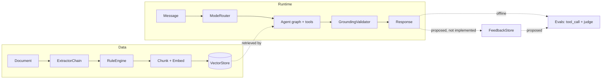

# RAG Agent Blueprint

A structure-only reference architecture for a RAG multi-agent system —
it demonstrates design decisions, not a production-ready deployment.

> This is a blueprint. It defines contracts and the reasoning behind
> them; implementations are deliberately left out so the design
> decisions stay readable.

## Why this exists

| Design question | Where the decision lives |
|---|---|
| Where should the boundary between primary extraction and a fallback path live? | `ingestion/extractors/` — a chain of independent extractors, so the fallback policy is a pluggable list, not an if/else |
| Where should safety signals and quality scores be reconciled? | `moderation/rules.py` — priority bands make the ordering explicit instead of implicit in code |
| Where does retrieval commit to a concrete backend, and where does it stay swappable? | `indexing/` — two adapter classes are the only places a backend choice is named |
| Where does a conversation's behavior get decided, so the agent loop itself doesn't have to branch? | `agent/router.py` and `agent/graph.py` — routing lives in one node, not scattered through the loop |
| Where does hallucination get caught, and by what — the prompt, or something outside it? | `guardrails/grounding.py` — a check that runs after generation, outside the prompt entirely |

See [`docs/architecture.md`](docs/architecture.md) for the full write-up:
a problem/options/decision/cost breakdown for all 7 blocks, the
boundaries and trade-off tables, and known limits.

## Stack

| Component | Technology |
|---|---|
| Agent orchestration | LangGraph (`StateGraph`, Postgres checkpointer) |
| Relational + vector storage | PostgreSQL + pgvector |
| Embeddings & chat completions | Any OpenAI-compatible API (selected via `base_url`) |
| PDF extraction | PyMuPDF |
| OCR fallback | Tesseract (via pytesseract) |
| Chunk sizing | tiktoken (`cl100k_base`) |
| Tests | pytest |
| Packaging | uv + hatchling |

## Architecture



## Project status

Non-functional scaffolding is the intended scope, not a stage this
project is passing through — see
[Known limits](docs/architecture.md#known-limits) for exactly what that
leaves out and what it would take to go further.

## Project structure

```
src/rag_agent_blueprint/
├── ingestion/               # cascading extraction with quality-based fallback
│   ├── extractors/          # PyMuPDF (native PDF) + Tesseract (OCR fallback)
│   └── pipeline.py
├── moderation/              # rule-based moderation with a status record
│   ├── models.py
│   ├── classifier.py        # OpenAI-compatible chat completions
│   ├── rules.py              # RulePriority bands + SafetyRule example
│   └── store.py             # Postgres
├── indexing/                # chunk -> embed -> vector store
│   ├── chunking.py          # tiktoken-bounded chunk sizing
│   ├── embeddings.py        # OpenAI-compatible embeddings API
│   ├── vector_store.py      # Postgres + pgvector
│   └── pipeline.py
├── agent/                   # LangGraph agent: mode router + tools
│   ├── state.py
│   ├── router.py
│   ├── prompts/              # stable-prefix / per-turn-suffix SystemPrompt
│   │   ├── __init__.py       # SystemPrompt, PromptBuilder
│   │   └── caching.py        # keeps the stable prefix reusable across turns
│   ├── graph.py              # LangGraph StateGraph + Postgres checkpointer
│   └── tools/                # 5 RAG tools (search, scoped search, fragment,
│                             #  summarize, generate questions) + CodeSandboxTool
├── guardrails/              # deterministic, post-generation validation
│   ├── grounding.py
│   └── degrade.py
├── evals/                   # tool-call check (deterministic) + LLM-as-judge
│   ├── tool_call_eval.py
│   ├── judge_eval.py        # OpenAI-compatible chat completions
│   ├── dataset_promotion.py # bridge from feedback/ (proposed)
│   └── datasets/
└── feedback/                # proposed design (Postgres)
    ├── models.py
    └── store.py

examples/documents/          # synthetic runbooks and product manuals
tests/                       # one skeleton test module per block
```

## Setup

```bash
uv sync
uv run pytest
```

## License

MIT — see [`LICENSE`](LICENSE).

Full architecture write-up: [`docs/architecture.md`](docs/architecture.md).
