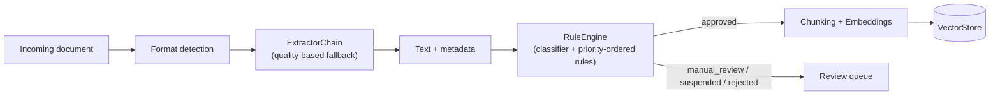
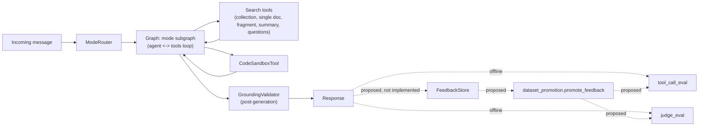

# Architecture

Two lanes: a data lane (ingestion → moderation → indexing) and an agent
runtime lane (router → tools → guardrail → evals). Block 7 (feedback) is
a proposed design — it has a defined connection into evals
(`dataset_promotion.py`), but no concrete implementation.

## Lane 1 — Data

## Lane 2 — Agent runtime

## Blocks

1. **Ingestion** (`ingestion/`): a prioritized list of `Extractor`s is
   tried in order until one produces an `ExtractionResult` above a
   minimum quality bar — PyMuPDF for native PDF text, Tesseract (via
   pytesseract) as the OCR fallback. See `extractors/chain.py`.
2. **Moderation** (`moderation/`): a `ContentClassifier` (chat
   completions against an OpenAI-compatible API) produces
   `ClassificationSignals`, and a `RuleEngine` resolves them against
   `ModerationRule`s ordered by `RulePriority` — `SAFETY` sorts ahead of
   `POLICY` and `QUALITY` as a structural constant, not just a
   convention, so a low score can never override a safety signal on its
   own (`SafetyRule` is a worked example of the pattern). Each rule
   resolves to a `RuleOutcome` (status + `ModerationReason`), which
   persists in Postgres as a `ReviewRecord` via `ModerationStore`.
3. **Indexing** (`indexing/`): full text is split by a `Chunker`
   (`RecursiveTokenChunker`, bounded by tiktoken's `cl100k_base` token
   count), each chunk is embedded via an OpenAI-compatible embeddings
   endpoint (`EmbeddingClient`), and stored in Postgres + pgvector
   (`VectorStore`) behind an `upsert` + `similarity_search` contract.
4. **Agent** (`agent/`): a cheap `ModeRouter` decides which subgraph
   handles the turn; the graph (`build_graph`) compiles a LangGraph
   `StateGraph` wiring the router, the available `Tool`s, and the
   guardrail together, checkpointed to Postgres for conversation
   persistence. `AgentState` carries messages (via LangGraph's
   `add_messages` reducer), active mode, and search history across
   turns. Five RAG tools cover the basics: whole-collection search
   (`DocumentSearchTool`), search scoped to one document
   (`SearchWithinDocumentTool`), a direct single-chunk lookup
   (`GetDocumentFragmentTool`), and two that answer from a small
   representative sample instead of the full document
   (`SummarizeDocumentTool`, `GenerateQuestionsTool`) via
   `VectorStore.get_representative_fragments`. `PromptBuilder` returns a
   `SystemPrompt` split into a stable prefix (identity, mode guidelines,
   toolset instructions) and a per-turn suffix (per-turn context), and
   `agent/prompts/caching.py` keeps that prefix in the same position
   every turn so it stays reusable wherever the underlying provider
   supports prefix-based caching.
5. **Guardrails** (`guardrails/`): `GroundingValidator` runs after the
   response is generated and only corrects what real `tool_outputs`
   prove false — it never deletes or invents what it can't verify.
   `degrade.py` covers a closed set of failure modes with predefined
   responses instead of letting the model improvise. Neither is tied
   to a specific library — this logic is plain Python.
6. **Evals** (`evals/`): `tool_call_eval.py` is a deterministic check
   (was the expected tool called?); `judge_eval.py` calls a separate
   model over the same OpenAI-compatible API to score transcripts
   against a versioned rubric, running multiple passes and comparing
   the median against a baseline with a fixed tolerance.
   `dataset_promotion.py` is the bridge from block 7: it decides whether
   a piece of feedback becomes a new `ToolCallCase`/`JudgeCase`.
7. **Feedback** (`feedback/`): `FeedbackRecord` (Postgres, via
   `FeedbackStore`) captures a like/dislike per turn.
   `evals.dataset_promotion.promote_feedback` decides whether it's
   promoted into an eval dataset — a `dislike` requires human review
   first, a `like` can be promoted more directly. This is the one
   cross-block connection in this scaffold that isn't implemented yet,
   only proposed as a contract.

## Lessons

One entry per block: the problem it exists to solve, the realistic
options, which one this scaffold picked, what that choice costs, and
where the contract for it lives. Written at the level of public
industry patterns — no concrete thresholds, vendor names, or
system-specific vocabulary.

### 1. Ingestion

- **The problem**: if every file format is handled by its own hard-coded
  branch, adding a new format means editing a central dispatcher, and
  a single bad extractor can take down ingestion for formats that don't
  even use it.
- **The options**: (a) one "universal" parser that claims to handle
  everything; (b) one extractor per format wired through an if/elif
  dispatcher; (c) a prioritized chain of independent extractors, each
  able to decline or produce a result with an attached quality score.
- **The decision**: (c) — chain of responsibility with a quality gate on
  every attempt.
- **The cost**: more moving parts than a single dispatcher, and a
  document can silently take a slower or lower-fidelity path when the
  preferred extractor's output fails the quality bar — not obvious to a
  caller who doesn't inspect the result.
- **Where it lives**: `ingestion/extractors/chain.py` —
  `ExtractorChain.run(filename, content_type, raw_bytes) -> ExtractionResult`.

### 2. Moderation

- **The problem**: if one aggregate score decides everything, either
  legitimate low-quality content gets rejected outright, or a high
  score can accidentally excuse content that should never be approved.
- **The options**: (a) a single quality-score threshold; (b) an LLM
  makes the entire decision end-to-end with no structure around it;
  (c) explicit rule priority, where safety-class rules are evaluated
  — and can veto — before any quality-based rule is consulted.
- **The decision**: (c).
- **The cost**: more rules to maintain and reason about than one score,
  and the priority ordering has to be actively protected — a new rule
  registered at the wrong priority band silently breaks the guarantee.
- **Where it lives**: `moderation/rules.py` —
  `RuleEngine.evaluate(signals, quality_score) -> RuleOutcome`, ordered
  by `RulePriority`.

### 3. Indexing

- **The problem**: if chunk size is arbitrary, retrieval quality is
  inconsistent and decoupled from what the model reading the chunk can
  actually process, and comparing differently-sized chunks becomes
  unpredictable.
- **The options**: (a) fixed character-length chunks; (b) split only by
  structural unit (paragraph/section) regardless of resulting size;
  (c) recursively split on structure, but bound the result by a token
  count matching the consuming model's tokenizer.
- **The decision**: (c).
- **The cost**: boundaries can still land mid-thought when structural
  separators don't line up with the token limit, and the chunker is now
  coupled to knowing which tokenizer the downstream model uses.
- **Where it lives**: `indexing/chunking.py` — `Chunker.split(text) ->
  list[Chunk]`, default implementation `RecursiveTokenChunker`.

### 4. Agent

- **The problem**: if one prompt has to handle every kind of request, it
  grows without bound, gets hard to test, and a change meant for one
  behavior risks regressing an unrelated one.
- **The options**: (a) one large prompt with internal branching
  instructions; (b) a fully separate, independent agent per behavior
  with no shared plumbing; (c) a cheap router that picks a mode and
  dispatches into subgraphs sharing one loop and toolset registry.
- **The decision**: (c).
- **The cost**: misrouting becomes its own failure mode — a correct
  answer produced under the wrong mode still reads as wrong — and the
  router itself now needs its own quality bar.
- **Where it lives**: `agent/router.py` (`ModeRouter.route(state) ->
  str`) and `agent/graph.py` (`build_graph(...) -> CompiledStateGraph`).

### 5. Guardrails

- **The problem**: if the only thing preventing fabricated claims is an
  instruction inside the prompt, there's no way to check afterward
  whether the model actually followed it — the instruction and its
  verification live in the same untrusted place.
- **The options**: (a) rely entirely on prompt instructions; (b) have a
  second LLM call double-check the first one's output; (c) a
  deterministic, non-LLM check that compares claims in the response
  against the actual data returned by tool calls.
- **The decision**: (c).
- **The cost**: it can only correct claims that contradict data it can
  actually see — an unverifiable claim passes through untouched, so
  this is a floor under hallucination, not a complete guarantee against it.
- **Where it lives**: `guardrails/grounding.py` —
  `GroundingValidator.verify_and_correct(response_text, tool_outputs) -> str`.

### 6. Evals

- **The problem**: if "did this get better or worse" is judged by eye,
  regressions from a prompt or model change get caught late,
  inconsistently, or not at all.
- **The options**: (a) no formal evals, manual spot-checking; (b) a
  single LLM-as-judge score as the only signal; (c) two separate
  checks — a deterministic one for mechanical correctness, and an
  LLM-judged one for qualitative response quality — run offline against
  a versioned dataset and a committed baseline.
- **The decision**: (c).
- **The cost**: maintaining two harnesses plus a dataset and a baseline
  is more upfront work than eyeballing a few examples, and neither
  harness runs automatically on every change, so a regression can still
  land before someone remembers to run them.
- **Where it lives**: `evals/tool_call_eval.py` (`run_tool_call_eval`)
  and `evals/judge_eval.py` (`run_judge_eval`).

### 7. Feedback

- **The problem**: if user reactions are captured but never looked at
  again, they're a UI decoration, not a signal — and if they're allowed
  to change the eval dataset with no review, a bad-faith or mistaken
  vote can quietly poison it.
- **The options**: (a) don't capture feedback at all; (b) capture it and
  feed it straight into the eval dataset automatically; (c) capture it,
  then route it through an explicit promotion decision — asymmetric by
  vote type — before it can affect anything.
- **The decision**: (c).
- **The cost**: feedback has no effect until the promotion step (and,
  for negative votes, the review it requires) is actually implemented —
  until then it's data collected but inert, an honest trade-off, not a
  free one.
- **Where it lives**: `feedback/store.py` (`FeedbackStore.record`) and
  `evals/dataset_promotion.py` (`promote_feedback`).

## Boundaries

Two kinds of pluggable point: interfaces with no tech commitment (still
swappable), and concrete adapters bound to this scaffold's chosen stack
(LangGraph, Postgres + pgvector, an OpenAI-compatible API, PyMuPDF +
Tesseract). Together they stand in for a single centralized `ports.py`.

**Framework-agnostic interfaces**

| Interface | File | What it decouples |
|---|---|---|
| `Extractor` | `ingestion/extractors/base.py` | The ingestion pipeline from any specific file-format extraction library |
| `ExtractorChain` | `ingestion/extractors/chain.py` | Which extractor handles a file from the ingestion pipeline itself — the fallback policy is swappable |
| `ModerationRule` / `RuleEngine` | `moderation/rules.py` | Individual policy decisions from the order (`RulePriority`) in which they're resolved — `SafetyRule` is a worked example |
| `Chunker` | `indexing/chunking.py` | The chunking strategy from the indexing pipeline |
| `ModeRouter` | `agent/router.py` | Which conversational mode handles a turn from the agent graph itself |
| `PromptBuilder` | `agent/prompts/__init__.py` | System prompt assembly from the graph/runtime |
| `Tool` | `agent/tools/base.py` | What a tool does from how the agent graph invokes it |
| `GroundingValidator` | `guardrails/grounding.py` | Hallucination-correction policy from response generation |

**Concrete adapters (this scaffold's pinned stack)**

| Class / function | File | Technology | What it decouples |
|---|---|---|---|
| `PDFNativeExtractor` | `ingestion/extractors/pdf_native.py` | PyMuPDF | Native PDF text extraction from the rest of the extractor chain |
| `OCRFallbackExtractor` | `ingestion/extractors/ocr_fallback.py` | Tesseract (pytesseract) | OCR from the rest of the extractor chain |
| `ContentClassifier` | `moderation/classifier.py` | OpenAI-compatible chat completions | The moderation rule engine from any specific classification backend |
| `ModerationStore` | `moderation/store.py` | Postgres (psycopg) | The moderation status record from its persistence backend |
| `RecursiveTokenChunker` | `indexing/chunking.py` | tiktoken (`cl100k_base`) | Token-bounded chunk sizing from a specific model's tokenizer |
| `EmbeddingClient` | `indexing/embeddings.py` | OpenAI-compatible embeddings API | Indexing/retrieval from a specific embedding provider — swapping providers means pointing `base_url` elsewhere |
| `VectorStore` | `indexing/vector_store.py` | Postgres + pgvector | Similarity search, scoped search, single-fragment lookup, and representative sampling, all from any other vector database |
| `build_graph` | `agent/graph.py` | LangGraph (`StateGraph`, Postgres checkpointer) | Turn orchestration from a hand-rolled control loop |
| `prepare_for_caching` | `agent/prompts/caching.py` | Prefix-based prompt caching (any provider that supports it) | Where the stable-prefix boundary goes from the rest of prompt assembly |
| `FeedbackStore` | `feedback/store.py` | Postgres (psycopg) | Feedback capture from any specific persistence backend (proposed only) |
| `promote_feedback` | `evals/dataset_promotion.py` | — (plain Python) | Whether/how feedback becomes an eval case from the eval harness itself (proposed only) |

## Trade-offs

| Decision | Alternative discarded | Why |
|---|---|---|
| Deterministic, post-generation grounding check | Relying on prompt instructions alone to prevent hallucination | Prompt instructions can't be audited against what the model actually received; a post-generation check can compare claims to real tool output |
| Cheap mode router before the agent loop | Running one large prompt that branches on intent internally | Keeps latency/cost low on the common case, at the risk of the whole turn misrouting if the cheap classifier is wrong |
| Chain-of-responsibility extractors with per-result quality validation | One fixed extractor per file format | More robust against corrupted or unusual input, at the cost of extra latency when earlier extractors fail |
| Manual, offline eval harness | Gating every pull request on the evals in CI | Keeps the eval signal trustworthy (no "green but meaningless" runs) at the cost of not catching regressions automatically on every change |
| A single OpenAI-compatible client for both embeddings and chat, selected via `base_url` | Hard-coding one commercial provider's SDK throughout the codebase | Self-hosted and third-party servers implementing the same API can be swapped in without touching call sites — concrete stack, not locked to one vendor |
| One Postgres instance for relational state, pgvector, and the LangGraph checkpointer | A separate specialized store per concern (e.g. a dedicated vector DB, a separate queue for checkpoints) | Fewer moving parts for a reference deployment, at the cost of one database having to scale for very different access patterns |
| A single, fixed stable-prefix boundary in the system prompt | A second boundary placed after the per-turn suffix (or inside conversation history) | Prefix-based caching invalidates everything after the first thing that changed; once the per-turn suffix changes (most turns), a second boundary after it never gets reused, so it only pays a write cost with no matching benefit |
| `SummarizeDocumentTool`/`GenerateQuestionsTool` read a representative sample, not the full document | Concatenating every chunk of the document into the prompt | Keeps token cost bounded regardless of document length, at the cost of the sample possibly missing something a full read would catch |

## Known limits

This scope is a deliberate decision, not unfinished work — but it is
still worth being explicit about what it leaves out. Concretely:

- Nothing is implemented — every concrete method still raises
  `NotImplementedError`. There is no working ingestion, retrieval, or
  agent loop to run, even though the dependencies (LangGraph, psycopg,
  pgvector, PyMuPDF, pytesseract, openai, tiktoken) are declared and
  installable.
- There is no server, CLI, or Dockerfile, and no actual Postgres/pgvector
  instance, Tesseract install, or API key — adding any of them would
  imply a runnable system, which this deliberately isn't yet.
- No thresholds, model names, or latency/cost numbers have been
  measured, because no implementation exists yet to measure them
  against.
- Authentication, authorization, rate limiting, and multi-tenancy are
  not modeled anywhere in this scaffold.
- Error handling, retries, and observability (logging/tracing)
  contracts are not defined.
- The test suite (`tests/`) only asserts that each interface exists and
  that calling it raises `NotImplementedError` — it says nothing about
  the correctness of a real implementation once one exists.
- `feedback/` and its connection to evals (`dataset_promotion.py`) are a
  proposed contract with no concrete implementation, and nothing calls
  either of them yet.
- The synthetic example corpus (`examples/documents/`) is small and
  hand-written — it is useful to sanity-check chunking/retrieval logic,
  not representative of a real corpus's scale or diversity.
- Before this pattern could serve real users, at minimum: implement the
  method bodies against real infrastructure, add integration tests
  against that infrastructure, define and measure real eval thresholds
  instead of leaving them as placeholders, and add authentication and
  observability.
