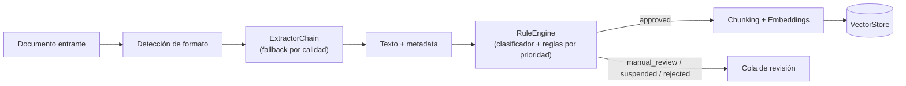
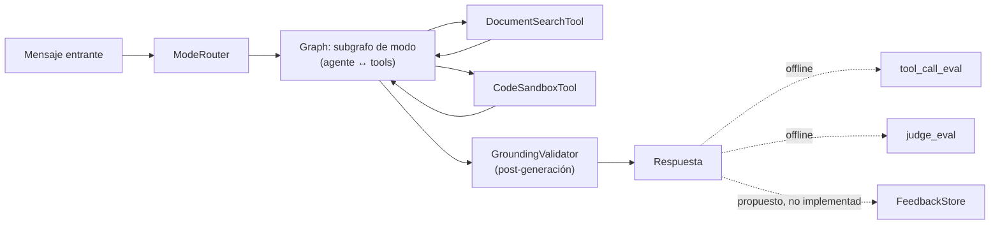

# Arquitectura

Dos carriles: uno de datos (ingesta → moderación → indexación) y uno de
runtime del agente (router → tools → guardrail → evals). El bloque 7
(feedback) es un diseño propuesto, no está conectado a nada todavía.

## Carril 1 — Datos

## Carril 2 — Runtime del agente

## Bloques

1. **Ingesta** (`ingestion/`): una lista priorizada de `Extractor` se
   prueba en orden hasta obtener un `ExtractionResult` que supere un
   umbral mínimo de calidad. Ver `extractors/chain.py`.
2. **Moderación** (`moderation/`): un `ContentClassifier` produce señales,
   y un `RuleEngine` las resuelve contra `ModerationRule`s ordenadas por
   prioridad — las reglas de seguridad van antes que las de calidad, para
   que un score bajo nunca pueda anular una señal de seguridad por sí
   solo. El resultado se persiste como `ReviewRecord` vía `ModerationStore`.
3. **Indexación** (`indexing/`): el texto completo se parte con un
   `Chunker` (por defecto, recursivo y acotado por tokens), cada chunk se
   embebe con un `EmbeddingModel` pluggable, y se guarda en un
   `VectorStore` con contrato de `upsert` + `similarity_search`.
4. **Agente** (`agent/`): un `ModeRouter` barato decide qué subgrafo
   maneja el turno; el grafo (`build_graph`) conecta el router, las
   `Tool`s disponibles y el guardrail. El `AgentState` lleva mensajes,
   modo activo e historial de búsqueda entre turnos. `PromptBuilder`
   separa identidad, guías de modo e instrucciones del toolset.
5. **Guardrails** (`guardrails/`): `GroundingValidator` corre después de
   generar la respuesta y solo corrige lo que los `tool_outputs` reales
   prueban falso — nunca borra ni inventa lo que no puede verificar.
   `degrade.py` cubre un vocabulario cerrado de fallos con respuestas
   predefinidas en vez de dejar que el modelo improvise.
6. **Evals** (`evals/`): `tool_call_eval.py` es un check determinista
   (¿se llamó la tool esperada?); `judge_eval.py` delega en un modelo
   separado que puntúa contra un rubric versionado, corriendo varias
   pasadas y comparando la mediana contra una baseline con tolerancia.
7. **Feedback** (`feedback/`): `FeedbackRecord` y `FeedbackStore` son un
   diseño propuesto para capturar like/dislike y, eventualmente,
   promover turnos a un dataset de eval — no está conectado a ningún
   otro bloque en este scaffold.
